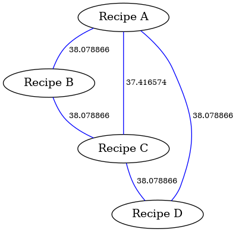

# Recipe Comparer

C project that takes in text files with recipe descriptions and outputs a graph with the results of comparison by euclidiean distance where each vector component is an ingredient in a recipe.

## Map implementation

This project uses a map implementation which can be found [here](https://github.com/rxi/map).

## Compilation and Execution

This project was designed to be compiled on Linux. Run `make` or `make debug` and this will automatically compile the project according to instructions on [Makefile](Makefile).
This then generates the compiled file as `RecipeComparer.o `. To execute the file, run: 
```
./RecipeComparer.o
```

## Visualization Tool
On this project the vizualization tool GraphViz was used to create an undirected and weighted graph to show the similarities of the recipes. 
In order for the visualization tool to work, GraphViz needs to be installed. To install this tool, run the following: 

```
sudo apt install graphviz
```
After running the main program, run the following command to generate the png file containing the graph:
```
dot -Tpng graph.gv -o graph.png
```
## Example input
An example of the input file can be found in [recepies.txt](recepies.txt)

## Example output 
An example of the output of running the project with the example input would be the file generated as [graph.gv](graph.gv)

By running the required command, the following image is generated: 

